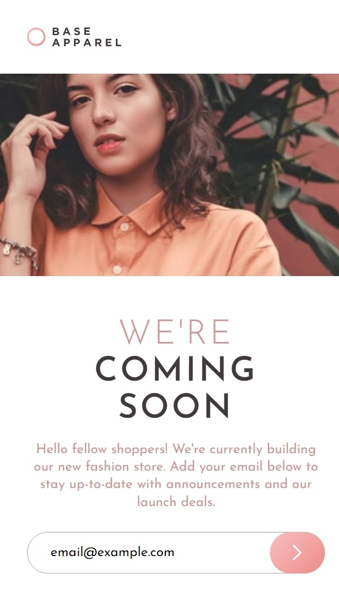
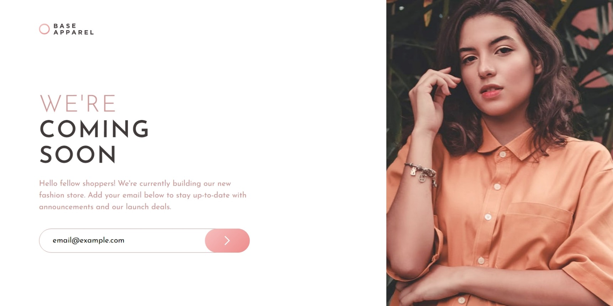

# Base Apparel coming soon page

This is a solution to the [Base Apparel coming soon page challenge on Frontend Mentor](https://www.frontendmentor.io/challenges/base-apparel-coming-soon-page-5d46b47f8db8a7063f9331a0).

## Table of contents

- [Overview](#overview)
  - [Screenshot](#screenshot)
  - [Links](#links)
- [My process](#my-process)
  - [Built with](#built-with)
- [Author](#author)

## Overview

### Screenshot

1. Mobile Design  

2. Desktop Design 

### Links

- Solution URL: [Git Repository URL](https://github.com/arsalanansariofficial/base-home-page.git)

## My process

### Built with

- Semantic HTML5 markup
- CSS custom properties
- Flexbox
- Mobile-first workflow

## Author

- Website - [Arsalan Ansari](https://github.com/arsalanansariofficial/).
- Frontend Mentor - [@arsalanansariofficial](https://www.frontendmentor.io/profile/arsalanansariofficial).
